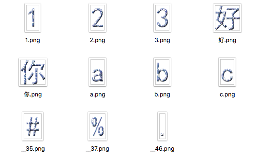

# Fast and easy way to generate BMFont with images

## Usage

1. Create a directory and use the name of the font you are generating
2. Prepare character images for the BMFont, you should name the images with the corresponding character, like `1.png, 好.png, a.png` in the following figure, or alternately you can name the image file with two underscores followed by the unicode of the character, like `__35.png, __37.png, __46.png` .
3. If necessary change some configurations in `gen_fnt.py`, and the parameters are in class `FntConfig`
4. Put the character images for generating font and the script `gen_fnt.py` in the directory created in step 1, and then run the script you will get the BMFont including a fnt description file and one or more image(s) as texture

## Requirement

Python 3.x
Pillow

---

# 方便快捷地用图片生成BMFont字体文件

## 使用方法

1. 新建目录，目录名称为将要生成的字体的名称
2. 准备用于生成字体的字符图片文件，注意将图片命名为字符，如下图中的`1.png, 好.png, a.png`，或将图片命名为双下划线加对应字符的unicode编码值，如下图中的`__35.png, __37.png, __46.png`
3. 根据需要，在`gen_fnt.py`中修改配置参数，位于类`FntConfig`中
4. 把用于生成字体的字符图片文件与`gen_fnt.py`放置于第1步新建的目录下，运行脚本，即可生成字体文件，包含一个`fnt`字体描述文件及一个或多个图片纹理

## 运行需要

Python 3.x
Pillow
